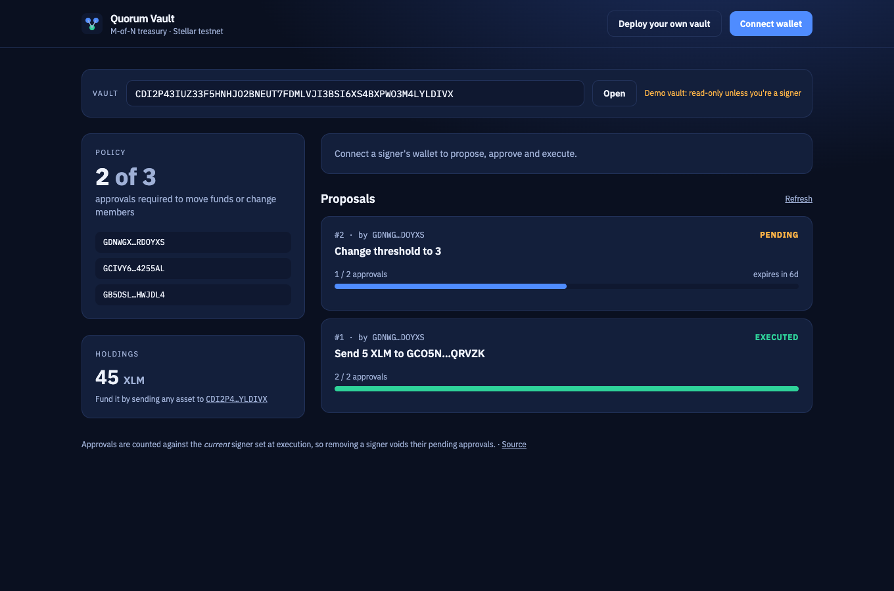

# Quorum Vault

**An M-of-N treasury for Stellar teams, DAOs and grant programs.**

Multisig Vault is a Soroban contract that holds tokens on behalf of a
group. Nothing leaves the vault, and nobody joins or leaves the group,
unless enough members approve it first. A 2-of-3 founders' wallet, a
5-of-9 DAO council and a grant committee's payout pot are all the same
contract with different settings.

## How it works

1. **Deploy and `init`** with a list of signers and a threshold
   (e.g. 3 signers, 2 approvals required).
2. **Fund it.** Anyone can send tokens to the contract address. No
   special function is needed.
3. **Propose** an action. The proposer must be a signer, and their
   approval is counted automatically.
4. **Approve.** Other signers approve before the proposal's deadline.
5. **Execute.** Once approvals reach the threshold, anyone can execute it.

A proposal can do one of four things:

| Action | Effect |
| --- | --- |
| `Transfer(token, to, amount)` | Pay out from the vault |
| `AddSigner(address)` | Add a member |
| `RemoveSigner(address)` | Remove a member (can't drop below the threshold) |
| `SetThreshold(n)` | Change how many approvals are needed |

Because governance changes go through the same approval flow, a team can
rotate a lost or compromised key **without redeploying or moving funds**.

## Safety properties

- **Approvals are counted against the current signer set.** If a member is
  removed, their earlier approvals on pending proposals stop counting.
- **Proposals expire.** A stale, half-approved payout can't be executed
  months later by surprise.
- **Signers can revoke** their approval any time before execution.
- **No duplicates, no empty sets**, a maximum of 20 signers, and the
  threshold always stays between 1 and the number of signers.
- **Single execution.** Executed and cancelled proposals are final.
- Storage lifetimes (TTL) are extended on every write, so a live vault and
  its proposals don't get archived.

## Contract interface

| Function | Who signs | Notes |
| --- | --- | --- |
| `init(signers, threshold)` | — | Once only |
| `propose(proposer, action, expires_at)` | proposer (a signer) | Returns the proposal id |
| `approve(signer, proposal_id)` | signer | |
| `revoke_approval(signer, proposal_id)` | signer | |
| `execute(proposal_id)` | anyone | Needs threshold approvals from current signers |
| `cancel(proposer, proposal_id)` | proposer | Pending proposals only |
| `get_proposal`, `signers`, `threshold`, `balance(token)` | anyone | Read state |

Errors: `AlreadyInitialized (1)`, `NotInitialized (2)`, `InvalidThreshold (3)`,
`InvalidSigners (4)`, `NotSigner (5)`, `ProposalNotFound (6)`, `NotPending (7)`,
`Expired (8)`, `AlreadyApproved (9)`, `NotApproved (10)`, `ThresholdNotMet (11)`,
`InvalidAmount (12)`, `InvalidExpiry (13)`, `NotProposer (14)`.

Events: `("vault","proposed")`, `("vault","approved", id)`,
`("vault","executed")`, `("vault","cancelled")`.

## Build, test and deploy

```bash
cd contracts
cargo test                    # 14 unit tests
stellar contract build

stellar contract deploy --wasm target/wasm32v1-none/release/multisig_vault.wasm \
  --source me --network testnet
stellar contract invoke --id <VAULT> --source me --network testnet -- \
  init --signers '["G...ALICE","G...BOB","G...CAROL"]' --threshold 2
```

Propose paying 500 XLM to a contractor:

```bash
stellar contract invoke --id <VAULT> --source alice --network testnet -- \
  propose --proposer alice \
  --action '{"Transfer":["<XLM_SAC_ID>","G...CONTRACTOR","5000000000"]}' \
  --expires_at 1767225600
```

## Web app



A treasury dashboard for any Quorum Vault, at `web/`:

- **Vault overview**: the M-of-N policy, signers (yours highlighted) and live XLM holdings. Open any vault by id (`?vault=C…` links are shareable).
- **Proposal board**: every proposal with its action in plain English, an approval meter counted against the *current* signers, expiry and status.
- **Signer actions**: approve, withdraw approval, execute once the threshold is met, or cancel your own proposal.
- **Composer**: propose a transfer (any asset), add or remove a signer, or change the threshold, with a deadline.
- **Deploy your own vault**: deploys a fresh instance from the uploaded wasm and initializes your signer set, in two wallet confirmations.

```bash
cd web
npm install
npm run dev        # http://localhost:5173
```

It talks to the contract deployed on **Stellar testnet** and signs with
[Freighter](https://www.freighter.app) (switch it to Testnet). Point it at
another deployment with `VITE_CONTRACT_ID` (see `web/.env.example`).
`netlify.toml` at the repo root deploys it as-is.

## Documentation

- [Architecture](docs/architecture.md)
- [Operating a vault](docs/operating-a-vault.md)
- [Contributing](CONTRIBUTING.md) · [Security policy](SECURITY.md) · [Changelog](CHANGELOG.md)

## Glossary (new to Stellar?)

- **Multisig (M-of-N)**: N people share control, and any M of them
  together can act. 2-of-3 means any two of three signers.
- **Threshold**: the M in M-of-N, the number of approvals needed.
- **Proposal**: a pending action waiting for approvals.
- **Soroban**: Stellar's smart-contract platform (Rust → WebAssembly).
- **Stellar Asset Contract (SAC)**: the contract address that represents a
  Stellar asset (including XLM) inside Soroban.
- **Ledger timestamp**: the network's clock in Unix seconds, which
  `expires_at` is compared against.
- **TTL / archival**: Soroban data expires unless its lifetime is
  extended. This contract extends it automatically.

## License

MIT
